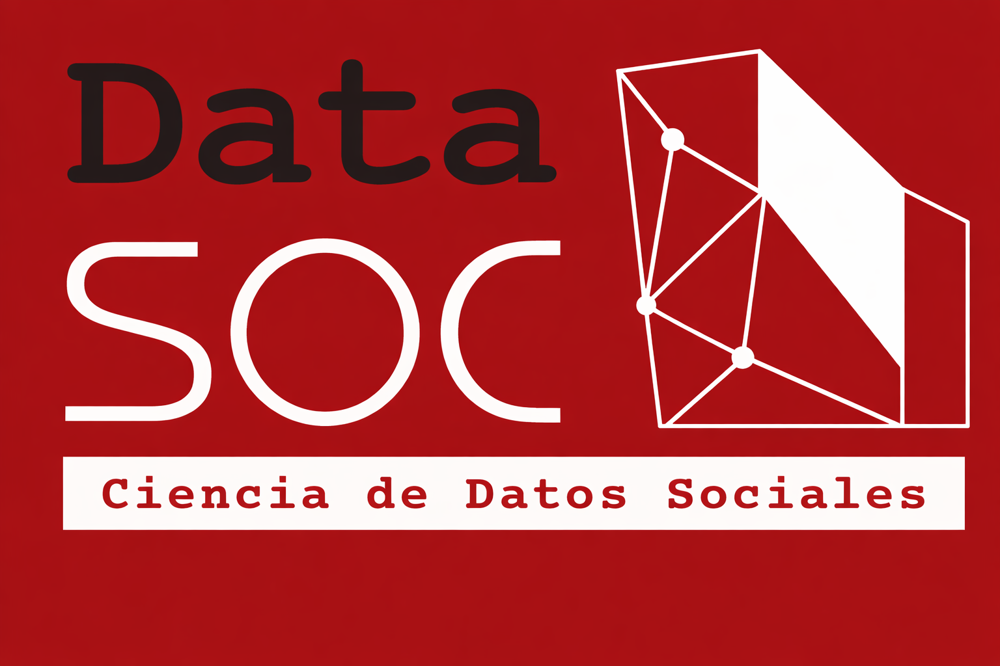

---
format:
  revealjs:
    theme: workshop.scss
    transition: slide
    transition-speed: slow
    slide-number: true
    show-slide-number: print
editor: source
---

# {background-color="#a81014"}

Herramientas computacionales para la investigación social reproducible  

**Workshop Universidad de Concepción, viernes 6 de Marzo, 2026**

::: {.columns .v-center-container}
::: {.column width="40%"}

{width="70%"}

:::

::: {.column width="60%"}

**Juan Carlos Castillo**

**Tomás Urzúa**

Departamento de Sociología, Universidad de Chile

:::
:::

:::{=html}

  
  <a href="https://github.com/data-soc/workshop-reproducibilidad" target="_blank" style="vertical-align: middle; font-size: 1em;">
    Github Repo
  </a>

:::

##

::: {.columns .v-center-container}
::: {.column width="40%"}

:::
::: {.column width="60%"}

[DataSOC]{.red} es un Centro de Datos Sociales de la Facultad de Ciencias Sociales de la Universidad de Chile, orientado a posicionarse como un referente en el análisis, procesamiento, gestión y transferencia de datos sociales, en un marco de ciencia
abierta, y guiado por altos estándares conceptuales, metodológicos y éticos.

:::
:::

## Descripción general

:::{.scrollbox style="max-height:600px; overflow:auto; padding:12px; border:1px solid #842b2bff; border-radius:6px; background: #e6bfbfff;"}
- Actualmente, la gran disponibilidad de datos y la demanda de información hacen necesario contar con herramientas de análisis y reporte de resultados que hagan el trabajo más eficiente, transparente y colaborativo. 

- Este curso introduce una serie de herramientas computacionales especializadas en escritura, análisis de datos y versionamiento, que facilitan y automatizan la generación de reportes finales de resultados de investigación. 

- Estas herramientas de ciencia de datos comprenden un entorno de edición (VSC), escritura abierta (Markdown), versionamiento (Git/GitHub), publicación de resultados (Quarto) y automatización de referencias (Zotero/BibTeX/BetterBibTeX). 

- El uso de estos recursos computacionales se incrementa cada vez más a nivel nacional e internacional y permite un alto estándar de eficiencia y calidad.
:::

## Objetivos

:::{.scrollbox style="max-height:600px; overflow:auto; padding:12px; border:1px solid #842b2bff; border-radius:6px; background: #e6bfbfff;"}

**Objetivo general**

Introducir el uso de herramientas computacionales (VSC, Git/GitHub, Quarto, Zotero) que favorezcan la eficiencia y promuevan la transparencia, la reproducibilidad y la accesibilidad en la investigación.

**Objetivos específicos**

- Comprender los fundamentos de la reproducibilidad en la investigación.
- Manejar software para la generación de documentos dinámicos y presentaciones con Quarto.
- Aplicar técnicas de control de versiones con Git y GitHub para el trabajo colaborativo.
- Utilizar herramientas para automatizar referencias bibliográficas.

:::

## Contenidos

:::{.scrollbox style="max-height:600px; overflow:auto; padding:12px; border:1px solid #842b2bff; border-radius:6px; background: #e6bfbfff;"}

1. **Introducción al análisis de datos reproducibles**
- 1.1 Apertura y reproducibilidad: Principios de la Ciencia Abierta
- 1.2 Ética y eficiencia en el proceso de investigación

2. **Editores de código abierto: Acercamiento a Visual Studio Code**
- 2.1 Reconocimiento del entorno de trabajo
- 2.2  Recomendaciones en VSC: Acciones, extensiones y shortcuts

3. **Texto plano, markdown y Quarto** 
- 3.1 Fundamentos del texto plano 
- 3.2 Utilidades de Markdown: texto y código unificado
- 3.3 Introducción a los documentos dinámicos
- 3.4 Formatos de salida de Quarto
- 3.5 Estructura básica de presentaciones con Quarto
- 3.6 Estilización de presentaciones

4. **Git y Github**
- 6.1 Lógica de versionamiento en Git
- 6.2 Git y Github en VSC
- 6.3 Proceso de publicación en plataformas abiertas con GitHub Pages

5. **Zotero en texto plano / Quarto**
- 7.1 Utilidades de bibliotecas compartidas
- 7.2 Automatización de referencias bibliográficas en Quarto con Zotero y BetterBibTeX

:::

##  Antes de comenzar
 
- [Instalar Visual Studio Code](https://code.visualstudio.com/)

- [Instalar Git](https://git-scm.com/downloads)

- [Crear cuenta en github.com](https://github.com/)









